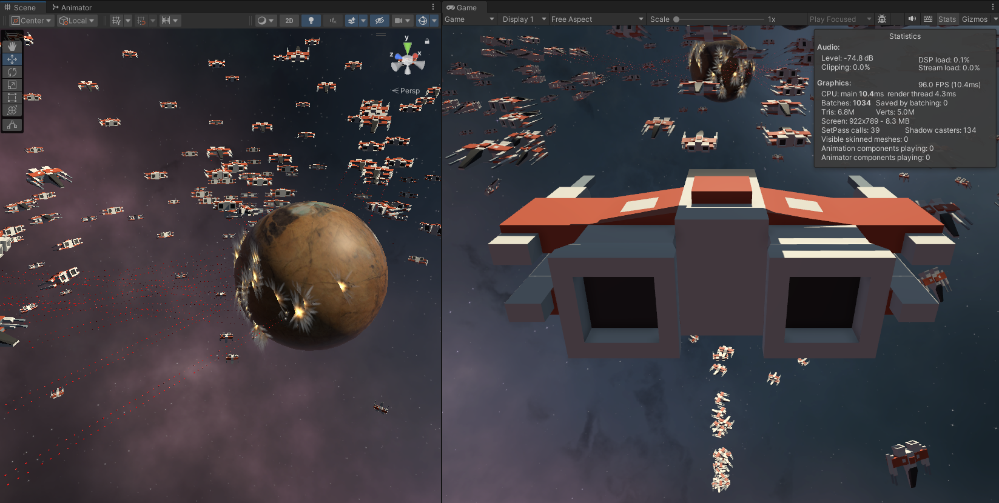

# Unity DOTS 1.0 Tech Demo
Unity 2022.3.7 | Entities Package v1.0.14
## Overview

* **Spaceship Generation**: Spaceships are dynamically spawned in large quantities. The number of spaceships is customizable within the editor.
* **Spaceship Behavior**:
  * Upon spawning, each spaceship identifies the nearest planet.
  * The spaceship then proceeds towards that planet.
  * As the spaceship approaches a specified distance from the planet, it begins firing at it.
  * Once the spaceship is in close proximity to the planet, it reverses its course and repeats the entire process.
* **Camera Interaction**:
  * Initially, the camera automatically tracks one randomly selected spaceship.
* Players can switch the camera's focus to another spaceship by pressing the Space key.

## Topics Covered

- `ISystem`
- `IJobEntity`
- `IComponentData`
- `Baker`
- `EntityCommandBuffers` to Remove Entities
- ~~`DynamicBuffer` to store authoring array data into Entities~~
- `IEnableableComponent` to disable shooting component when spaceship is out of target
- `QueryBuilder` to iterate component Data inside an `IJobEntity`

